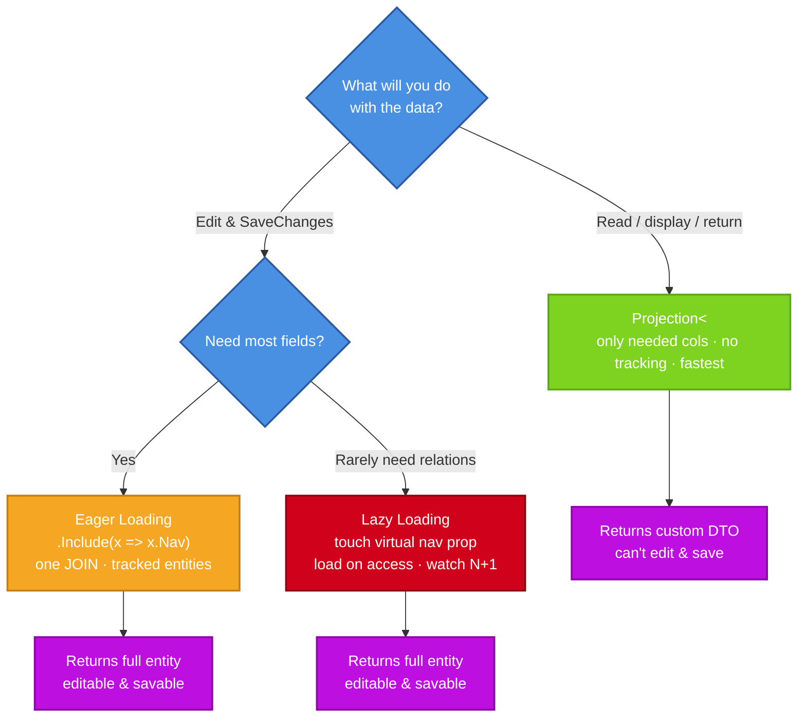
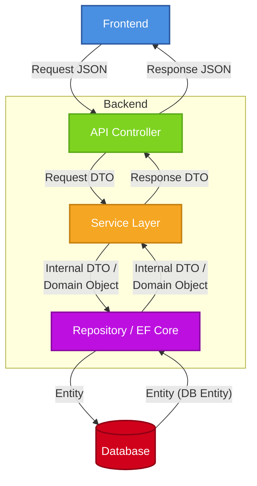

  # Lambda
A lambda expression is a short, anonymous (nameless) function that you can write inline without formally declare.
```
(<parameters>) => <expression/return>
```
The symbol `=>` is called the "goes to" operator (or "lambda operator").

An Example:
```
# Function way - 
int Double(int x)
{
    return x * 2;
}
# Lambda way -
x => x * 2
```

# Interface
An **interface** is a contract that defines the methods and properties a class must implement.

An Example

Without 'Interface':
```
public class Zoo
  {
      private Dog _dog = new Dog { Name = "Rex" };   // ❌ Hardcoded to Dog
      public void FeedingTime() => _dog.MakeSound();
  }
```

With 'Interface':
```
 public interface IAnimal
  {
      string Name { get; }
      void MakeSound();
  }
public class Dog : IAnimal
  {
      public string Name { get; set; }
      public void MakeSound() => Console.WriteLine($"{Name} says: Woof!");
  }

  public class Cat : IAnimal
  {
      public string Name { get; set; }
      public void MakeSound() => Console.WriteLine($"{Name} says: Meow!");
  }


 public class Zoo
  {
      private IAnimal _animal;
      public Zoo(IAnimal animal) { _animal = animal; }   // Accept any animals
      public void FeedingTime() => _animal.MakeSound();
  }

  var dogZoo = new Zoo(new Dog { Name = "Rex" });
  var catZoo = new Zoo(new Cat { Name = "Whiskers" });
  dogZoo.FeedingTime();   // Rex says: Woof!
  catZoo.FeedingTime();   // Whiskers says: Meow!
```

`Zoo` no longer knows or cares what concrete animal it has. This is **loose coupling**.

# Delegate
A delegate is a type that holds a reference to a method which can be passes as an argument to another method like a variable.

A delegate is essentially a lightweight, single-method version of an **interface**.

Example 1 — Declaring and using a delegate:
```
// Step 1: Declare a delegate TYPE — the method's signature
public delegate int MathOperation(int a, int b);
//  `MathOperation` is a type, just like int or string. Any method matching int (int, int) can be assigned to it.

public class Calculator
{
    public static int Add(int a, int b) => a + b;
    public static int Multiply(int a, int b) => a * b;
}

class Program
{
    static void Main()
    {
        // Step 2: Create an instance pointing to a method
        MathOperation op = Calculator.Add;

        // Step 3: Invoke it like a method
        int result = op(3, 4);   // result = 7

        // Reassign to another method with the same signature
        op = Calculator.Multiply;
        result = op(3, 4);       // result = 12
    }
}
```

## Built-in Delegates
**Action**

Action is a family of built-in generic delegates in .NET, designed 
specifically to represent **"methods that return nothing (void)"**.


 All Signatures
```
Action                              // void Foo()
Action<T>                           // void Foo(T arg)
Action<T1, T2>                      // void Foo(T1 a, T2 b)
Action<T1, T2, T3>                  // void Foo(T1 a, T2 b, T3 c)
Action<T1, T2, T3, T4>              // void Foo(T1 a, T2 b, T3 c, T4 d)
// up to ...
Action<T1, T2, ..., T16>            // 16 parameters
```
Rewrite Example 1 with Action
```
public class Calculator
{
    // Return type becomes void
    public static void Add(int a, int b)  => Console.WriteLine($"{a} + {b} = {a + b}");;
    public static void Multiply(int a, int b) => Console.WriteLine($"{a} * {b} = {a * b}");;
}

class Program
{
    static void Main()
    {
        Action<int, int> op = Calculator.Add;

        // Invoke amethod withoutreturn to capture
        op(3, 4);  

        op = Calculator.Multiply;
        op(3, 4);       
    }
}
```

**Func**

Func is a family of built-in generic delegates in .NET, designed specifically to represent **"methods that return a value"**.

All Signatures
```
Func<TResult>                          // TResult Foo()
Func<T, TResult>                       // TResult Foo(T arg)
Func<T1, T2, TResult>                  // TResult Foo(T1 a, T2 b)
Func<T1, T2, T3, TResult>              // TResult Foo(T1 a, T2 b, T3 c)
Func<T1, T2, T3, T4, TResult>          // TResult Foo(T1 a, T2 b, T3 c, T4 d)
// up to ...
Func<T1, T2, ..., T16, TResult>        // 16 parameters + return
```
The LAST generic parameter is ALWAYS the return type (TResult)

Rewrite Example 1 with Func
```
public class Calculator
{
    public static int Add(int a, int b) => a + b;
    public static int Multiply(int a, int b) => a * b;
}

class Program
{
    static void Main()
    {
        // Use Func<int,int,int> instead of MathOperation
        Func<int, int, int> op = Calculator.Add;

        // Invoke 
        int result = op(3, 4);   

        op = Calculator.Multiply;
        result = op(3, 4);       

        Console.WriteLine(result);
    }
}
```


## Comparison between INTERFACES and DELEGATES
Rewrite Example 1 in an *Interface*:
```
// Interface version
public interface IMathOperation
{
    int Execute(int a, int b);
}

public class AddOperation : IMathOperation
{
    public int Execute(int a, int b) => a + b;
}

public class MultiplyOperation : IMathOperation
{
    public int Execute(int a, int b) => a * b;
}

// Usage
IMathOperation op = new AddOperation();
int result = op.Execute(3, 4);    // 7

op = new MultiplyOperation();
result = op.Execute(3, 4);        // 12
```

**Comparison 1: Granularity**

Delegate: wraps a single method
```
public delegate int MathOperation(int a, int b);
```
Interface: can have multiple methods AND properties
```
public interface IMathOperation
{
    int Execute(int a, int b);
    string Name { get; }              // can also have properties
    bool IsCommutative();             // can have more methods
}
```
**Comparison 2: Must create a class vs inline lambda**

With interface: must create a class for every behavior
```
public class IsEvenFilter : IFilter
{
    public bool Apply(int n) => n % 2 == 0;
}
var evens = FilterNumbers(nums, new IsEvenFilter());
```
With delegate: just write a lambda inline
```
var evens = FilterNumbers(nums, n => n % 2 == 0);
```


# Generic
A **generic** is a class or method that uses a placeholder for a type, allowing it to work with different data types while maintaining type safety. 

**Generic Class**

The simplest examples - `List<string>`
```
class Program
  {
      static void Main()
      {
          List<IAnimal> animals = new List<IAnimal>
          {
              new Dog { Name = "Rex" },
              new Cat { Name = "Whiskers" }
          };

          foreach (IAnimal animal in animals)
          {
              animal.MakeSound();
          }
      }
  }
```
```
public class Box<T>
{
    public T Value { get; set; }

    public void SetValue(T value)
    {
        Value = value;
    }
}

Box<int> intBox = new Box<int>();
intBox.SetValue(10);

Box<string> stringBox = new Box<string>();
stringBox.SetValue("Hello");
```

**Generic Method**
`Function<int>`
```
public class Utility
{
    public T GetFirst<T>(T[] items)
    {
        return items[0];
    }
}

Utility util = new Utility();

int firstInt = util.GetFirst<int>(new int[] { 1, 2, 3 });
string firstString = util.GetFirst<string>(new string[] { "A", "B" });
```

A more complicated example with both *Interface* and *Generic*:

Create:
- interface `IStorage<T>` with void `Add(T item) `and `T Get(int index)`
- class `MemoryStorage<T> : IStorage<T>` that uses a `List<T>` internally
- Use it with two different types in `Main` (e.g. `MemoryStorage<string>`and `MemoryStorage<Dog>`)


```
public interface IStorage<T>
  {
      void Add(T item) ;
      T Get(int index)
  }
```
```
public class MemoryStorage<T> : IStorage<T>
{
    private List<T> _items = new List<T>();

    public void Add(T item)
    {
        _items.Add(item);
    }

    public T Get(int index)
    {
        return _items[index];
    }
}
```
```
using System;
using System.Collections.Generic;

class Program
{
    static void Main()
    {
        // ---- Storage for strings ----
        IStorage<string> wordStore = new MemoryStorage<string>();
        wordStore.Add("hello");
        wordStore.Add("world");
        Console.WriteLine(wordStore.Get(0));   // hello
        Console.WriteLine(wordStore.Get(1));   // world

        // ---- Storage for Dogs (re-using the Dog class from before) ----
        IStorage<Dog> dogStore = new MemoryStorage<Dog>();
        dogStore.Add(new Dog { Name = "Rex" });
        dogStore.Add(new Dog { Name = "Buddy" });
        dogStore.Get(0).MakeSound();   // Rex says: Woof!
        dogStore.Get(1).MakeSound();   // Buddy says: Woof!
    }
  }
```

# LINQ
**LINQ** stands for **Language-Integrated Query**. It is a powerful feature in C# that allows you to write queries directly in C# code to retrieve and manipulate data from different sources (like collections, databases, XML, JSON, etc.) using a unified syntax.

**Method syntax** uses extension methods on collections, chained together with lambdas. Most LINQ methods have a direct SQL equivalent.

## Basic Operations

### SQL SELECT → LINQ Select()
Project/transform data:
SQL - `SELECT Name, Salary FROM Employees;`
```
var result = employees.Select(e => new { e.Name, e.Salary });
```
Select with calculation:
```
var result = employees.Select(e => new {
    e.Name,
    AnnualSalary = e.Salary * 12   // Anual Salary
});
```

### SQL WHERE → LINQ Where()
Filter Rows:
SQL - `SELECT * FROM Employees WHERE Salary > 5000;`
```
var result = employees.Where(e => e.Salary > 5000);
```
Multiple conditions:
SQL - `SELECT * FROM Employees WHERE Salary > 5000 AND Department = 'IT';`
```
var result = employees.Where(e => e.Salary > 5000 && e.Department == "IT");
```
Search and Sort Data (Ascending/Descneding)
SQL - `SELECT * FROM Employees ORDER BY Salary DESC;`
```
var result = employees.OrderByDescending(e => e.Salary);
```

### ToList()
`ToList() `is an immediate execution extension method that iterates the entire `IEnumerable<T>` sequence and copies all elements into a new `List<T>`, which it returns.

It's main functions: 
1. Trigger Query Execution, 
2. Switch from DB to In-Memory in EF Core and  
3. Snapshot the Data

### Include()
`Include()` is an Entity Framework (EF Core) method used for **eager loading** related data.

## Loading & Projection
**Projection** - 
Select and reshape data into a new class you define (a DTO), pulling only the fields you name, and EF does not track it - but can't edit-and-save by Projection.
```
var projects = SearchContacts(name, email, null, null)   // IQueryable<Contact>
    .Select(x => new ContactDetails()        // ← project into a DTO
    {
        Name     = x.Name,
        Address     = x.Address,    // ← with only selected columns
        ... ...
    })
    .ToList();
```
**Loading** - 
Fetch the database entity objects whole. EF tracks them, and nav props can still lazy-load.
- Eager Loading（预加载）: Load Everything Up Front
  > Loads related data together immediately when querying the main entity. <br>
  > e.g. `Include() / Select()`
- Lazy Loading（懒加载）: Load On First Access
  > Loads only the main entity first; fires an extra query when the navigation property is accessed. <br> In EF Core, lazy loading is OFF by default! You must opt in with a package `optionsBuilder.UseLazyLoadingProxies();`.
- Explicit Loading (显式加载) : Load Manually On Demand
  > Loads the main entity first, then you explicitly command the related data to load.



## Deferred Methods & Immediate Methods
**Deferred Execution**
- When you call the method, the query does NOT run immediately. It just returns a "query object" (`IEnumerable<T>` or `IQueryable<T>`). The query only executes when you actually iterate it (via foreach) or call an immediate execution method.
- Returns `IEnumerable<T>` or `IQueryable<T>`

**Immediate Methods**
-  When you call the method, it iterates the data source immediately and returns a concrete result (a value, a list, or an array).
-  Returns a concrete type (`int, bool, List<T>, T`)

## IEnumerable
IEnumerable<T> is C#'s unified interface for "iterable collections". - 可被遍历的集合

## IQueryable


## DTO
DTO = Data Transfer Object

It's a simple class designed specifically to carry data between layers of a system. Typically contains only properties, no business logic.

Four Core Responsibilities of DTOs：

1. Decoupling 隔离 - Separate internal structure from external API
2. Security - Hide sensitive fields
3. Shape Tailoring - Send exactly what the consumer needs
4. Transport Optimization - Flat, serialization-friendly, small payload

DTOs in a Typical Layered Architecture：


#   Dependency Injection
Polymorphism(多态) means the same interface can have multiple different implementations.
